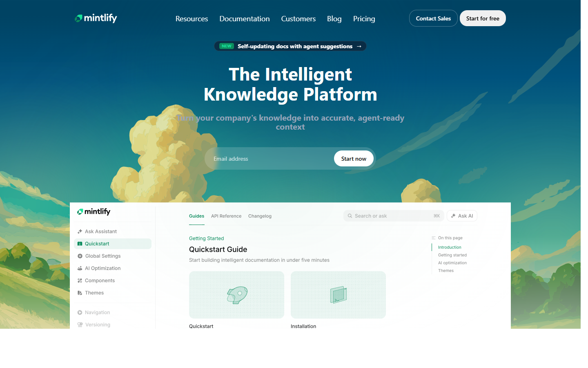
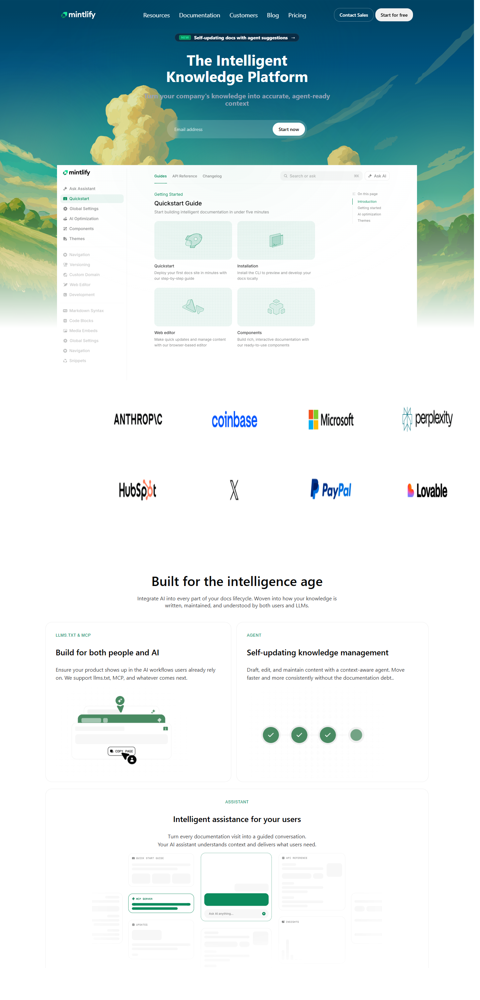

# Mintlify Landing Page Clone

A high-fidelity recreation of the [Mintlify](https://mintlify.com/) landing page, built to demonstrate modern web design techniques and responsive layout implementation.

## About The Project

This project simulates the aesthetic and structural design of the Mintlify documentation platform's landing page. It showcases uses of:
- **Semantic HTML5** for accessible structure
- **CSS3** for styling, including Flexbox and Grid layouts
- **Glassmorphism** effects using backdrop filters
- **Responsive Design** adapting to different screen sizes

## Built With

- HTML5
- CSS3
- Google Fonts (Inter)
- SVG Icons

## Screenshots

### Hero Section


### Full Page Overview


## Getting Started

To view the project locally:

1. Clone the repository
   ```bash
   git clone <your-repo-url>
   ```
2. Open the project folder
3. Double-click `index.html` to open it in your default browser

## License

Distributed under the MIT License. See `LICENSE` for more information.
